# Camera 摄像机初探
*作者：大掌教*

*Q群：704391772*

**直播课地址：** [https://ke.qq.com/course/378768?tuin=3ce6693]( https://ke.qq.com/course/378768?tuin=3ce6693 )

---

Creator从2.0开始发生了巨大变化，其中最大的变化莫过于Camera组件。为什么说最大的改变是Camera组件，因为这是一个全新的组件，将游戏世界的渲染窗口暴露出来，这将是引擎从2d渲染向3d渲染的关键。

Camera是游戏渲染的窗口，场景里至少需要一个Camera，否则将无法渲染任何对象，世界将是一片黑暗。

### 要点
- 一个场景至少需要一个Camera，可以同时存在多个Camera。
- Camera本身不可见，渲染大小就是当前屏幕大小。
- 同一场景可以多个Camera可以分组渲染，各自渲染各自的分组对象。
- 多个Camera渲染的对象层次，由Camera深度Depth决定，值越大越后面渲染。同一个Camera渲染的对象，按照节点本身层级渲染，子节点总是在父节点后渲染。

## Camera案例——无限滚动视差背景
Camera组件属性可参考[官方文档](https://docs.cocos.com/creator/manual/zh/render/camera.html#摄像机属性)。

### 分组渲染

Creator编辑器在菜单`项目`->`项目设置`->`分组管理`中更改或添加。物理碰撞的分组管理也是这里设置的。

要实现分组渲染，首先需要在场景添加多个Camera，然后再分组管理添加多个分组，然后设置Camera的cullingMask属性为对应的分组。

1. 创建Camera节点，先创建一个空节点，然后在这个节点上添加Camera组件。添加两个Cameara节点，FarCamera和NearCamera，用来分别渲染远景和近景。

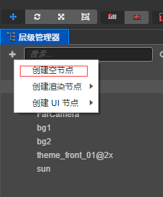 
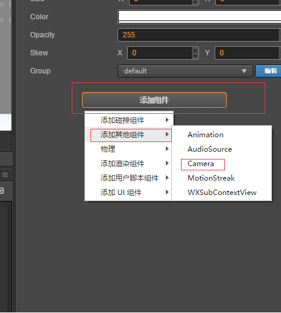

2. 添加分组，在分组管理里面添加两个分组，nearbg和farbg

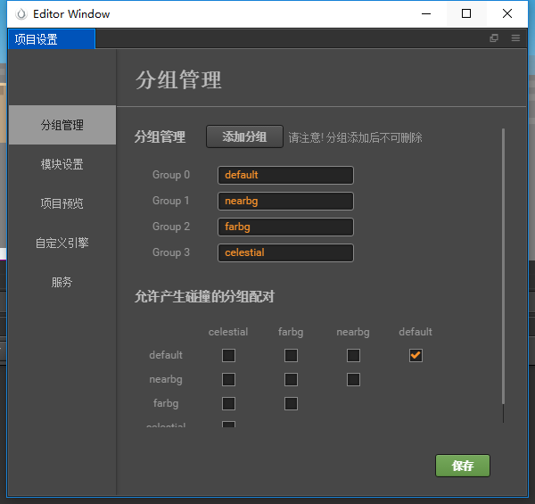

3. 场景中添加近景和远景节点，分别设置Group

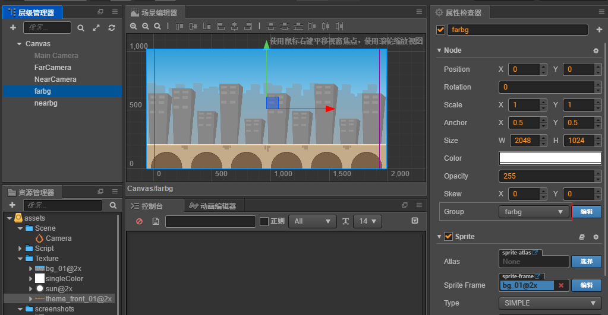

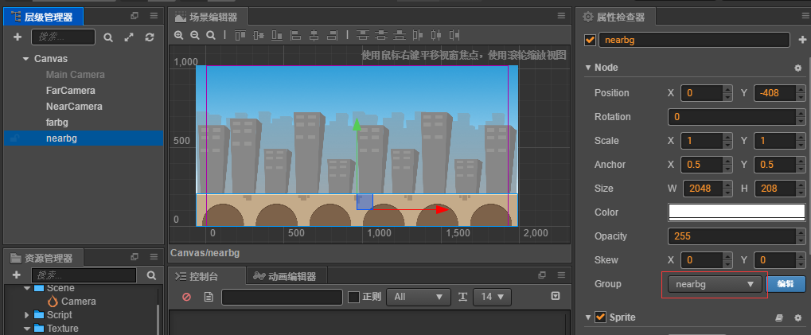

4. 设置Camera的cullMask为对应分组，FarCamera设置为farbg，NearCamera设置为nearbg。

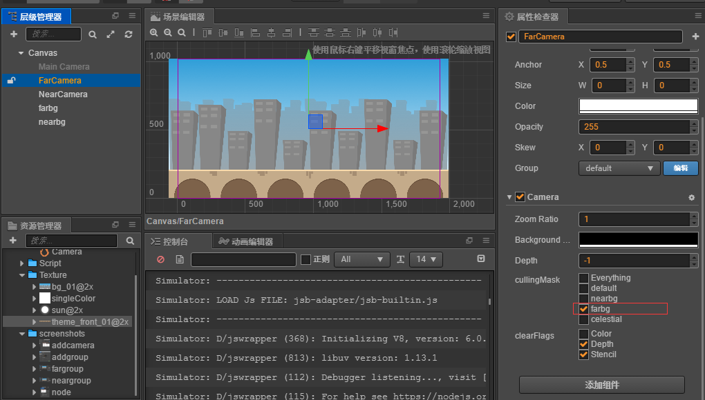

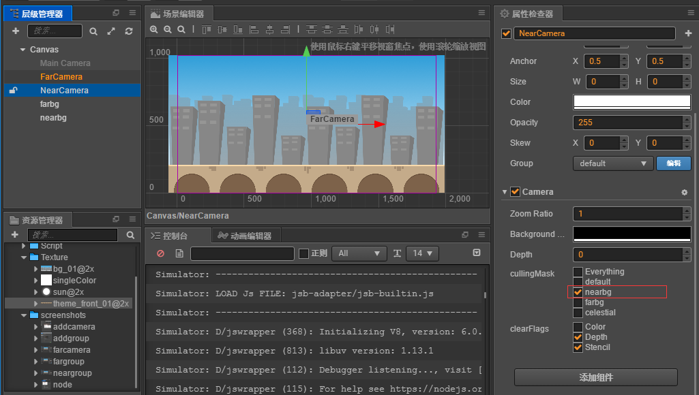

到这里多摄像机和分组渲染设置完成了，运行模拟器可以看到界面
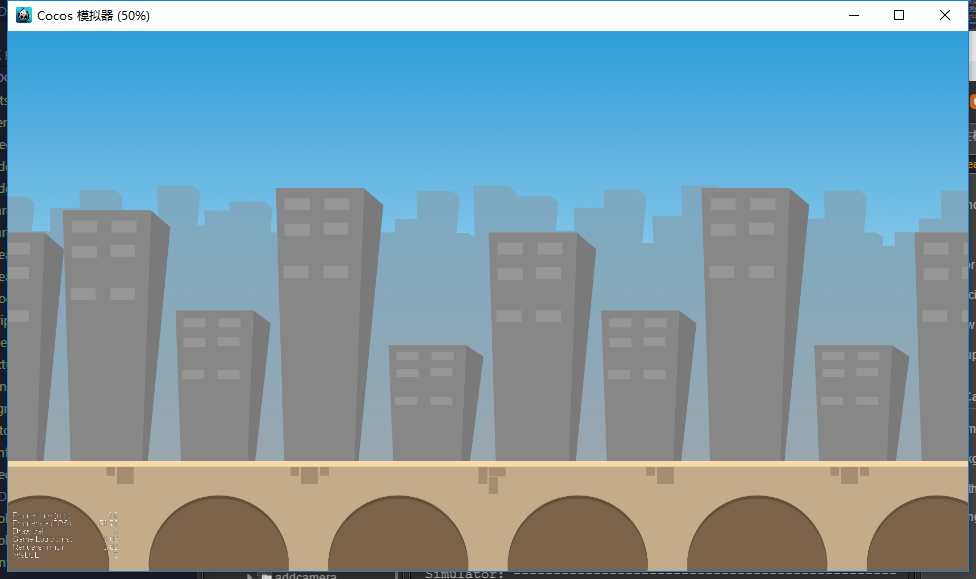

### 视差原理
背景图片固定不动，移动摄像机。因为我们看到的画面都是摄像机渲染的画面，渲染区域就是屏幕大小。由于运动的相对性，我们观察的视角就是摄像机视角，和摄像机同步，背景图片就相对向相反方向移动。

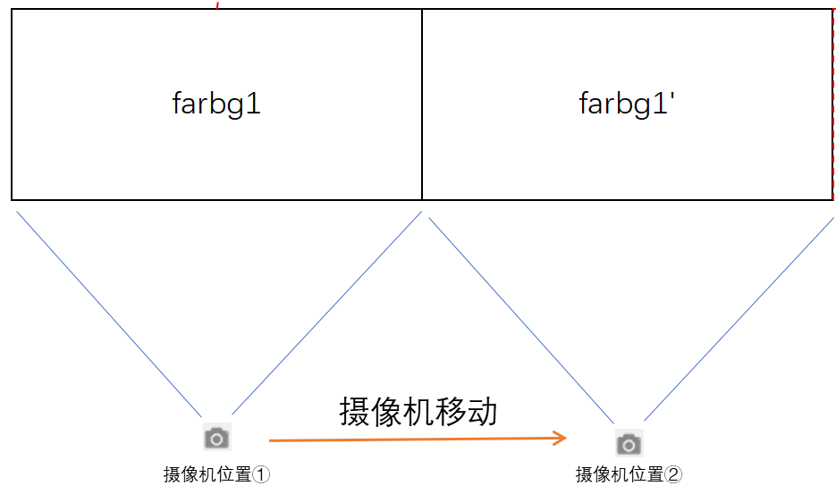

如图，由于横向不断移动，所以要做两个背景图，不断交替设置位置。
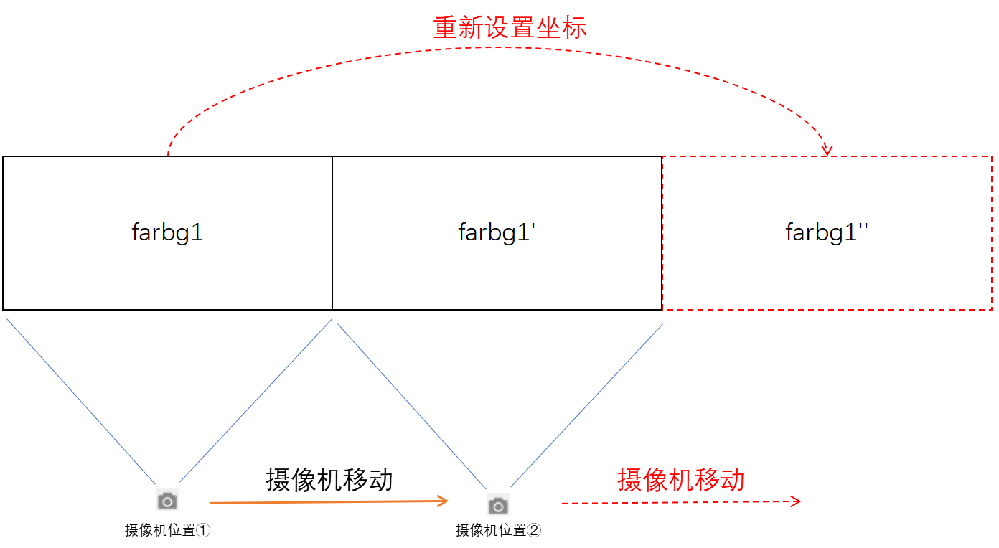

同样的原理，再设置一个近景，两组Camera移动的速度设置的不一致，就实现了无限滚动视差背景。

### 静景
有一些元素是不动的，比如太阳，月亮，挂在天上，如何实现？

新增分组celestial，将MainCamera开启，然后设置cullingMask为celestial，添加一个sun节点，分组设为celestial。

最终效果：
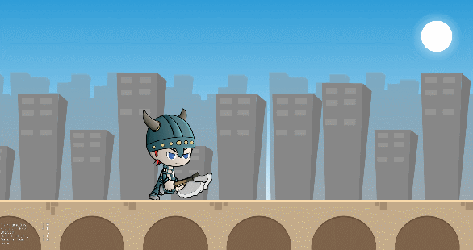

**Demo源码地址：** [https://github.com/fylz1125/CreatorDocuments](https://github.com/fylz1125/CreatorDocuments)

# 更多Creator教程
2.0开始，新增了很多新特性，引擎发生了很大变化，后续将会分享更多干活。另外，每晚21:00，我将会在腾讯课堂直播讲解Creator游戏开发技术与实战经验，欢迎感兴趣的开发者关注。

**直播地址：** [https://ke.qq.com/course/378768?tuin=3ce6693]( https://ke.qq.com/course/378768?tuin=3ce6693 )